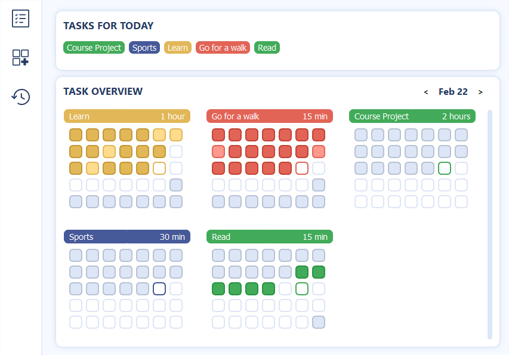

# Daily Tasks Tool
A tool to manage daily tasks organized in a calendar style.
This project is still in progress.
Developed in Python, Qt5 and SQLite.

# Current State
Overview: 
Highlights today's tasks that have not been completed yet.
Calendar to check off completed tasks.

See statistics: Statistics about the entire year, individual months and the current month.

Insert a new task

